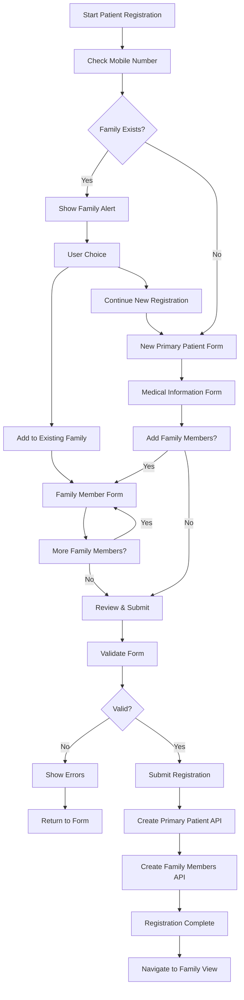
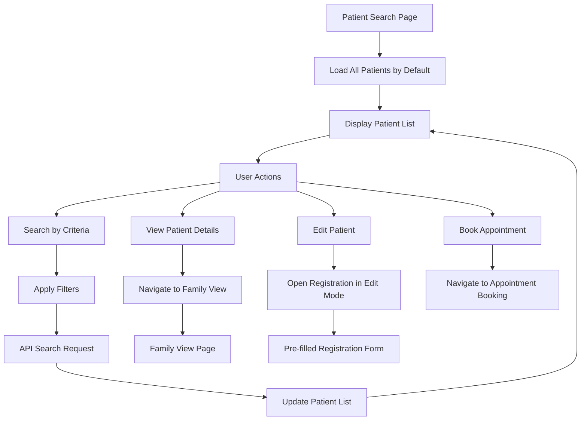
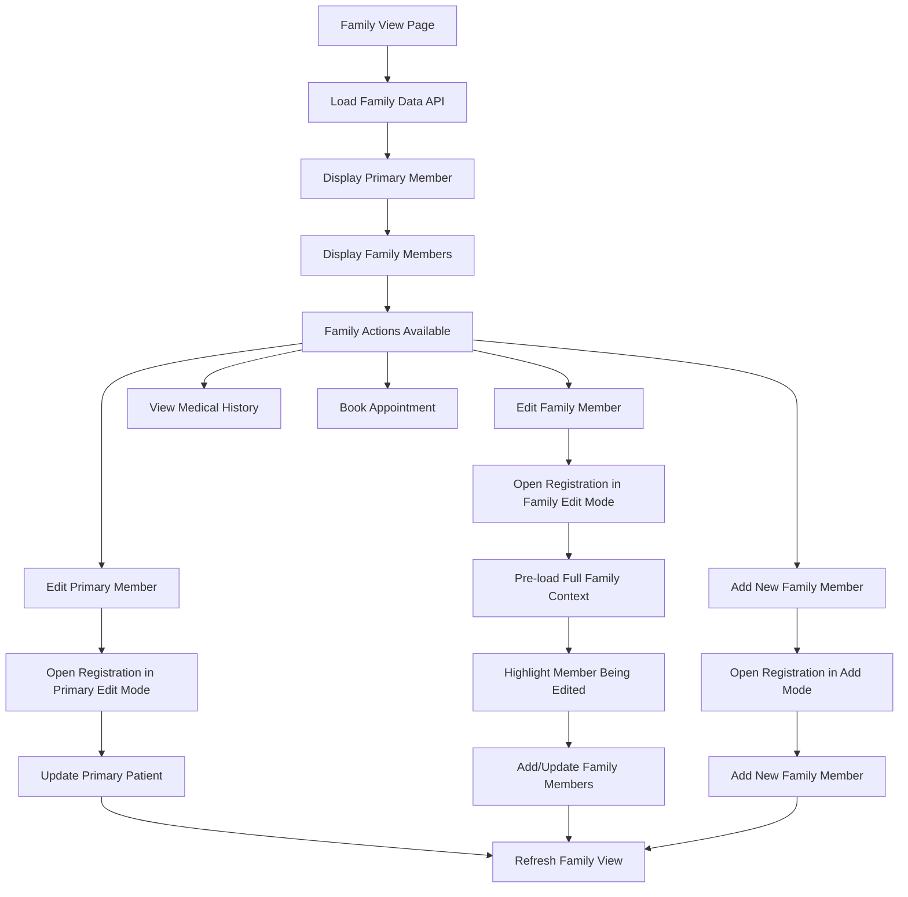
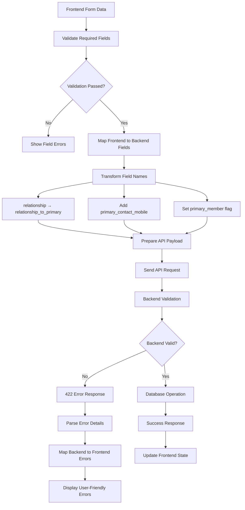
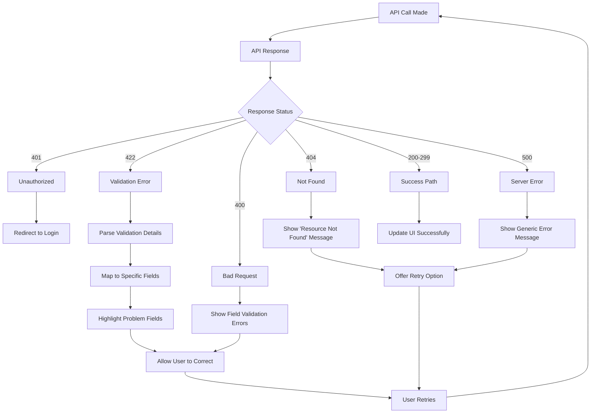

# Patient Management Flow Diagrams

**Last Updated**: November 2, 2025  
**Purpose**: Visual documentation of implemented patient management workflows

## 1. Patient Registration Flow



## 2. Patient Search & Management Flow



## 3. Family View & Management Flow



## 4. API Integration Flow

```mermaid
flowchart TD
    A[Frontend Component] --> B{Action Type}
    
    B -->|Create| C[Create Patient API]
    C --> D[POST /patients/]
    D --> E[Primary Member Created]
    E --> F[Create Family Members]
    F --> G[POST /patients/families/{mobile}]
    
    B -->|Search| H[Search Patients API]
    H --> I[GET /patients/?params]
    
    B -->|Load Family| J[Get Family Members API]
    J --> K[GET /patients/families/{mobile}]
    
    B -->|Update| L[Update Patient API]
    L --> M[PUT /patients/{mobile}/{name}]
    
    G --> N[Handle API Response]
    I --> N
    K --> N
    M --> N
    
    N --> O{Success?}
    O -->|Yes| P[Update UI State]
    O -->|No| Q[Handle Error]
    Q --> R[Show Error Message]
    Q --> S[Retry or Fallback]
    
    P --> T[Navigate or Refresh]
```

## 5. Field Mapping & Validation Flow



## 6. Edit Mode State Management

```mermaid
flowchart TD
    A[User Clicks Edit] --> B{Edit Type}
    
    B -->|Primary Member| C[Set editMode = 'primary']
    B -->|Family Member| D[Set editMode = 'family']
    
    C --> E[Load Primary Member Data]
    D --> F[Load Full Family Data]
    
    E --> G[Pre-fill Primary Form]
    F --> H[Pre-fill Family Context]
    H --> I[Highlight Editing Member]
    
    G --> J[Show Registration Form]
    I --> J
    
    J --> K[User Makes Changes]
    K --> L[Submit Form]
    
    L --> M{Edit Mode}
    M -->|Primary| N[Update Primary Patient Only]
    M -->|Family| O[Add New Family Members Only]
    
    N --> P[PUT /patients/{mobile}/{name}]
    O --> Q[POST /patients/families/{mobile}]
    
    P --> R[Success: Navigate to Family View]
    Q --> R
```

## 7. Error Handling & Recovery Flow



## Implementation Notes

### **Key Features Implemented**

1. **Multi-Step Registration**: 4-step wizard with validation at each step
2. **Family Support**: Multiple patients sharing same mobile number
3. **Edit Modes**: Separate handling for primary vs family member edits
4. **Field Mapping**: Proper transformation between frontend and backend
5. **Error Recovery**: Comprehensive error handling and user feedback
6. **Search & Filter**: Advanced patient search with multiple criteria
7. **Navigation**: Clean breadcrumb and route management

### **API Endpoints Used**

- `GET /patients/` - List/search patients
- `POST /patients/` - Create primary patient
- `GET /patients/families/{mobile}` - Get family members
- `POST /patients/families/{mobile}` - Add family member
- `PUT /patients/{mobile}/{name}` - Update patient (planned)

### **State Management**

- Redux Toolkit for global state
- RTK Query for API caching and data fetching
- Local component state for form management
- URL parameters for edit mode configuration

### **Data Flow Patterns**

1. **Optimistic Updates**: UI updates immediately, reverts on error
2. **Progressive Loading**: Family data loads as needed
3. **Cache Invalidation**: Automatic refresh after mutations
4. **Error Boundaries**: Graceful error recovery with user feedback