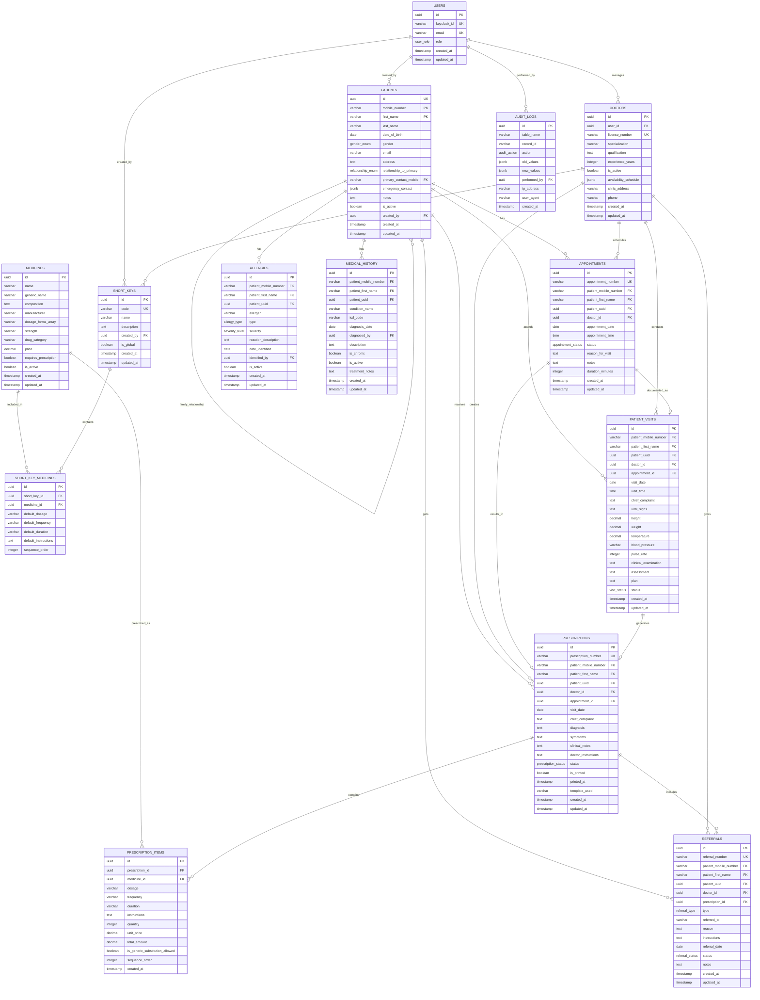

# Entity Relationship Diagram (ERD)
## Prescription Management System - Data Model Reference

---

**🎯 Purpose**: This document serves as the foundational reference for all data models, relationships, and business rules in the Prescription Management System. **Always refer to this document before adding features or debugging.**

---

## 📊 Database Entity Relationship Diagram

### Core Entity Relationships


---

## 🗂️ Database Enums and Types

### User Roles
```sql
CREATE TYPE user_role AS ENUM (
    'super_admin',
    'admin', 
    'doctor',
    'nurse',
    'receptionist',
    'patient'
);
```

### Patient Related Enums
```sql
CREATE TYPE gender_enum AS ENUM (
    'male',
    'female', 
    'other',
    'prefer_not_to_say'
);

CREATE TYPE relationship_enum AS ENUM (
    'self',
    'spouse',
    'child',
    'parent',
    'sibling', 
    'grandparent',
    'grandchild',
    'other'
);
```

### Medical Enums
```sql
CREATE TYPE appointment_status AS ENUM (
    'scheduled',
    'confirmed',
    'in_progress', 
    'completed',
    'cancelled',
    'no_show',
    'rescheduled'
);

CREATE TYPE prescription_status AS ENUM (
    'draft',
    'active',
    'dispensed',
    'completed',
    'cancelled',
    'expired'
);

CREATE TYPE referral_type AS ENUM (
    'laboratory',
    'radiology',
    'specialist_consultation',
    'physiotherapy',
    'surgery',
    'other'
);

CREATE TYPE referral_status AS ENUM (
    'pending',
    'scheduled',
    'completed',
    'cancelled'
);

CREATE TYPE visit_status AS ENUM (
    'scheduled',
    'in_progress',
    'completed',
    'cancelled'
);

CREATE TYPE allergy_type AS ENUM (
    'drug',
    'food',
    'environmental',
    'other'
);

CREATE TYPE severity_level AS ENUM (
    'mild',
    'moderate', 
    'severe',
    'life_threatening'
);

CREATE TYPE audit_action AS ENUM (
    'INSERT',
    'UPDATE',
    'DELETE',
    'LOGIN',
    'LOGOUT',
    'VIEW'
);
```

---

## 🏗️ Service Layer Data Models

### Core Service Models
```typescript
// Authentication & User Management
interface User {
  id: string;
  keycloakId: string;
  email: string;
  role: UserRole;
  createdAt: Date;
  updatedAt: Date;
}

interface AuthContext {
  user: User | null;
  token: string | null;
  permissions: Permission[];
  isAuthenticated: boolean;
  login: (credentials: LoginCredentials) => Promise<void>;
  logout: () => Promise<void>;
  refreshToken: () => Promise<void>;
}

// Patient Management
interface Patient {
  id: string;
  mobileNumber: string;
  firstName: string;
  lastName: string;
  dateOfBirth: Date;
  gender: Gender;
  email?: string;
  address?: string;
  relationshipToPrimary: Relationship;
  primaryContactMobile?: string;
  emergencyContact?: EmergencyContact;
  notes?: string;
  isActive: boolean;
  createdBy: string;
  createdAt: Date;
  updatedAt: Date;
}

interface PatientFamily {
  primaryContact: Patient;
  familyMembers: Patient[];
  totalMembers: number;
}

interface PatientRegistrationRequest {
  mobileNumber: string;
  firstName: string;
  lastName: string;
  dateOfBirth: Date;
  gender: Gender;
  email?: string;
  address?: string;
  relationshipToPrimary: Relationship;
  primaryContactMobile?: string;
  emergencyContact?: EmergencyContact;
  reasonForVisit: string;
}

// Doctor Management
interface Doctor {
  id: string;
  userId: string;
  licenseNumber: string;
  specialization: string;
  qualification: string;
  experienceYears: number;
  isActive: boolean;
  availabilitySchedule: AvailabilitySchedule;
  clinicAddress?: string;
  phone?: string;
  createdAt: Date;
  updatedAt: Date;
}

interface AvailabilitySchedule {
  monday: TimeSlot[];
  tuesday: TimeSlot[];
  wednesday: TimeSlot[];
  thursday: TimeSlot[];
  friday: TimeSlot[];
  saturday: TimeSlot[];
  sunday: TimeSlot[];
}

// Prescription Management
interface Prescription {
  id: string;
  prescriptionNumber: string;
  patient: PatientReference;
  doctor: DoctorReference;
  appointment?: AppointmentReference;
  visitDate: Date;
  chiefComplaint: string;
  diagnosis: string;
  symptoms?: string;
  clinicalNotes?: string;
  doctorInstructions?: string;
  status: PrescriptionStatus;
  items: PrescriptionItem[];
  referrals: Referral[];
  isPrinted: boolean;
  printedAt?: Date;
  templateUsed?: string;
  createdAt: Date;
  updatedAt: Date;
}

interface PrescriptionItem {
  id: string;
  medicine: Medicine;
  dosage: string;
  frequency: string;
  duration: string;
  instructions?: string;
  quantity: number;
  unitPrice?: number;
  totalAmount?: number;
  isGenericSubstitutionAllowed: boolean;
  sequenceOrder: number;
}

// Medicine Management
interface Medicine {
  id: string;
  name: string;
  genericName?: string;
  composition: string;
  manufacturer: string;
  dosageForms: string[];
  strength: string;
  drugCategory: string;
  price?: number;
  requiresPrescription: boolean;
  isActive: boolean;
  createdAt: Date;
  updatedAt: Date;
}

interface ShortKey {
  id: string;
  code: string;
  name: string;
  description?: string;
  medicines: ShortKeyMedicine[];
  createdBy: string;
  isGlobal: boolean;
  createdAt: Date;
  updatedAt: Date;
}

interface ShortKeyMedicine {
  medicine: Medicine;
  defaultDosage: string;
  defaultFrequency: string;
  defaultDuration: string;
  defaultInstructions?: string;
  sequenceOrder: number;
}

// Appointment Management
interface Appointment {
  id: string;
  appointmentNumber: string;
  patient: PatientReference;
  doctor: DoctorReference;
  appointmentDate: Date;
  appointmentTime: string;
  status: AppointmentStatus;
  reasonForVisit: string;
  notes?: string;
  durationMinutes: number;
  createdAt: Date;
  updatedAt: Date;
}
```

### Business Logic Services
```typescript
// Service Interfaces
interface PatientService {
  registerPatient(request: PatientRegistrationRequest): Promise<Patient>;
  findPatientByCompositeKey(mobile: string, firstName: string): Promise<Patient | null>;
  getFamilyMembers(mobileNumber: string): Promise<PatientFamily>;
  updatePatient(mobile: string, firstName: string, updates: Partial<Patient>): Promise<Patient>;
  searchPatients(query: PatientSearchQuery): Promise<PaginatedResult<Patient>>;
  getPatientHistory(mobile: string, firstName: string): Promise<PatientHistory>;
  validateRegistration(request: PatientRegistrationRequest): Promise<ValidationResult>;
}

interface PrescriptionService {
  createPrescription(request: CreatePrescriptionRequest): Promise<Prescription>;
  updatePrescription(id: string, updates: Partial<Prescription>): Promise<Prescription>;
  addPrescriptionItem(prescriptionId: string, item: PrescriptionItemRequest): Promise<PrescriptionItem>;
  loadShortKey(prescriptionId: string, shortKeyCode: string): Promise<PrescriptionItem[]>;
  validatePrescription(prescription: Prescription): Promise<ValidationResult>;
  checkDrugInteractions(medicineIds: string[]): Promise<DrugInteraction[]>;
  checkAllergies(patientKey: PatientKey, medicineIds: string[]): Promise<AllergyWarning[]>;
  generatePrescriptionPDF(id: string, template: string): Promise<Buffer>;
  printPrescription(id: string): Promise<PrintResult>;
}

interface AppointmentService {
  scheduleAppointment(request: ScheduleAppointmentRequest): Promise<Appointment>;
  getDoctorSchedule(doctorId: string, date: Date): Promise<DoctorSchedule>;
  updateAppointmentStatus(id: string, status: AppointmentStatus): Promise<Appointment>;
  getPatientAppointments(patientKey: PatientKey): Promise<Appointment[]>;
  checkAvailability(doctorId: string, date: Date, time: string): Promise<boolean>;
}

interface MedicineService {
  searchMedicines(query: string): Promise<Medicine[]>;
  getMedicineDetails(id: string): Promise<Medicine>;
  createShortKey(request: CreateShortKeyRequest): Promise<ShortKey>;
  updateShortKey(id: string, updates: Partial<ShortKey>): Promise<ShortKey>;
  getShortKeys(doctorId?: string): Promise<ShortKey[]>;
  validateShortKeyCode(code: string): Promise<boolean>;
}
```

---

## 🎨 UI/Frontend Data Models

### Component State Models
```typescript
// Form States
interface PatientRegistrationForm {
  mobileNumber: string;
  firstName: string;
  lastName: string;
  dateOfBirth: string;
  gender: Gender;
  email: string;
  address: string;
  relationshipToPrimary: Relationship;
  primaryContactMobile: string;
  emergencyContact: {
    name: string;
    phone: string;
    relationship: string;
  };
  reasonForVisit: string;
  errors: Record<string, string>;
  isSubmitting: boolean;
  isValid: boolean;
}

interface PrescriptionForm {
  patientKey: PatientKey;
  chiefComplaint: string;
  diagnosis: string;
  symptoms: string;
  clinicalNotes: string;
  doctorInstructions: string;
  items: PrescriptionItemForm[];
  referrals: ReferralForm[];
  shortKeyInput: string;
  templateSelected: string;
  errors: Record<string, string>;
  isSubmitting: boolean;
  isDirty: boolean;
}

interface PrescriptionItemForm {
  tempId: string;
  medicine: Medicine | null;
  dosage: string;
  frequency: string;
  duration: string;
  instructions: string;
  quantity: number;
  isGenericSubstitutionAllowed: boolean;
  errors: Record<string, string>;
}

// Page States
interface DoctorDashboardState {
  todayAppointments: Appointment[];
  upcomingAppointments: Appointment[];
  recentPrescriptions: Prescription[];
  pendingTasks: Task[];
  quickStats: {
    todayPatients: number;
    pendingAppointments: number;
    activePrescriptions: number;
  };
  isLoading: boolean;
  error: string | null;
}

interface PatientSearchState {
  query: string;
  filters: {
    dateRange: DateRange;
    gender: Gender | '';
    ageRange: AgeRange;
    relationship: Relationship | '';
  };
  results: Patient[];
  selectedPatient: Patient | null;
  familyMembers: Patient[];
  isSearching: boolean;
  hasMore: boolean;
  page: number;
}

interface PrescriptionListState {
  prescriptions: Prescription[];
  filters: {
    status: PrescriptionStatus | '';
    dateRange: DateRange;
    doctorId: string;
    patientSearch: string;
  };
  sortBy: 'date' | 'patient' | 'doctor' | 'status';
  sortOrder: 'asc' | 'desc';
  selectedPrescriptions: string[];
  isLoading: boolean;
  pagination: {
    page: number;
    limit: number;
    total: number;
    hasMore: boolean;
  };
}
```

### Store/State Management
```typescript
// Zustand Stores
interface AuthStore {
  user: User | null;
  token: string | null;
  permissions: Permission[];
  isAuthenticated: boolean;
  isLoading: boolean;
  
  // Actions
  login: (credentials: LoginCredentials) => Promise<void>;
  logout: () => Promise<void>;
  refreshToken: () => Promise<void>;
  updateUser: (updates: Partial<User>) => void;
  checkPermission: (permission: string) => boolean;
}

interface PatientStore {
  selectedPatient: Patient | null;
  familyMembers: Patient[];
  searchResults: Patient[];
  recentPatients: Patient[];
  
  // Actions
  selectPatient: (patient: Patient) => void;
  loadFamilyMembers: (mobileNumber: string) => Promise<void>;
  searchPatients: (query: PatientSearchQuery) => Promise<void>;
  registerPatient: (request: PatientRegistrationRequest) => Promise<Patient>;
  updatePatient: (key: PatientKey, updates: Partial<Patient>) => Promise<void>;
  clearSelection: () => void;
}

interface PrescriptionStore {
  currentPrescription: Prescription | null;
  recentPrescriptions: Prescription[];
  prescriptionDraft: PrescriptionForm;
  
  // Actions
  createPrescription: (request: CreatePrescriptionRequest) => Promise<Prescription>;
  updateDraft: (updates: Partial<PrescriptionForm>) => void;
  addPrescriptionItem: (item: PrescriptionItemForm) => void;
  removePrescriptionItem: (tempId: string) => void;
  loadShortKey: (code: string) => Promise<void>;
  saveDraft: () => Promise<void>;
  clearDraft: () => void;
  printPrescription: (id: string) => Promise<void>;
}

interface MedicineStore {
  medicines: Medicine[];
  shortKeys: ShortKey[];
  searchResults: Medicine[];
  
  // Actions
  searchMedicines: (query: string) => Promise<void>;
  loadShortKeys: (doctorId?: string) => Promise<void>;
  createShortKey: (request: CreateShortKeyRequest) => Promise<void>;
  updateShortKey: (id: string, updates: Partial<ShortKey>) => Promise<void>;
}
```

### API Client Models
```typescript
// API Response Types
interface ApiResponse<T> {
  data: T;
  message: string;
  success: boolean;
  timestamp: string;
}

interface PaginatedResponse<T> {
  data: T[];
  pagination: {
    page: number;
    limit: number;
    total: number;
    totalPages: number;
    hasMore: boolean;
  };
  message: string;
  success: boolean;
}

interface ValidationError {
  field: string;
  message: string;
  code: string;
}

interface ApiError {
  message: string;
  code: string;
  details?: ValidationError[];
  timestamp: string;
}

// API Client Interface
interface ApiClient {
  // Authentication
  auth: {
    login(credentials: LoginCredentials): Promise<AuthResponse>;
    logout(): Promise<void>;
    refreshToken(): Promise<TokenResponse>;
    getProfile(): Promise<User>;
  };
  
  // Patients
  patients: {
    register(request: PatientRegistrationRequest): Promise<Patient>;
    findByKey(mobile: string, firstName: string): Promise<Patient>;
    getFamilyMembers(mobile: string): Promise<PatientFamily>;
    search(query: PatientSearchQuery): Promise<PaginatedResponse<Patient>>;
    update(key: PatientKey, updates: Partial<Patient>): Promise<Patient>;
    getHistory(key: PatientKey): Promise<PatientHistory>;
  };
  
  // Prescriptions
  prescriptions: {
    create(request: CreatePrescriptionRequest): Promise<Prescription>;
    getById(id: string): Promise<Prescription>;
    update(id: string, updates: Partial<Prescription>): Promise<Prescription>;
    list(filters: PrescriptionFilters): Promise<PaginatedResponse<Prescription>>;
    print(id: string, template: string): Promise<Blob>;
    checkInteractions(medicineIds: string[]): Promise<DrugInteraction[]>;
  };
  
  // Medicines
  medicines: {
    search(query: string): Promise<Medicine[]>;
    getById(id: string): Promise<Medicine>;
    getShortKeys(doctorId?: string): Promise<ShortKey[]>;
    createShortKey(request: CreateShortKeyRequest): Promise<ShortKey>;
    updateShortKey(id: string, updates: Partial<ShortKey>): Promise<ShortKey>;
  };
  
  // Appointments
  appointments: {
    schedule(request: ScheduleAppointmentRequest): Promise<Appointment>;
    list(filters: AppointmentFilters): Promise<PaginatedResponse<Appointment>>;
    update(id: string, updates: Partial<Appointment>): Promise<Appointment>;
    getDoctorSchedule(doctorId: string, date: string): Promise<DoctorSchedule>;
  };
}
```

---

## 🔒 Business Rules and Constraints

### Data Integrity Rules
1. **Patient Composite Key**: `(mobile_number, first_name)` must be unique
2. **Family Relationships**: All family members share same `mobile_number`
3. **Primary Contact**: Family members reference `primary_contact_mobile`
4. **Active Status**: Soft delete using `is_active` flag
5. **Audit Trail**: All modifications tracked in `audit_logs`

### Validation Rules
```typescript
// Patient Registration Validation
const patientValidationRules = {
  mobileNumber: {
    required: true,
    pattern: /^[6-9]\d{9}$/, // Indian mobile format
    message: 'Valid 10-digit mobile number required'
  },
  firstName: {
    required: true,
    minLength: 2,
    maxLength: 100,
    pattern: /^[a-zA-Z\s]+$/,
    message: 'First name should contain only letters'
  },
  compositeKey: {
    unique: true,
    message: 'Patient with this mobile number and name already exists'
  },
  dateOfBirth: {
    required: true,
    maxDate: new Date(),
    message: 'Valid birth date required'
  }
};

// Prescription Validation
const prescriptionValidationRules = {
  diagnosis: {
    required: true,
    minLength: 3,
    maxLength: 500
  },
  prescriptionItems: {
    required: true,
    minItems: 1,
    maxItems: 20
  },
  drugInteractions: {
    checkInteractions: true,
    blockSevere: true
  },
  allergies: {
    checkAllergies: true,
    warnOnMatch: true
  }
};
```

### Security Rules
1. **Role-Based Access**: Users can only access data based on their role
2. **Data Ownership**: Doctors can only see their own prescriptions
3. **Patient Privacy**: Patients can only see their own data
4. **Audit Logging**: All data access and modifications logged
5. **Encryption**: Sensitive data encrypted at rest and in transit

---

## 🚀 Performance Considerations

### Database Optimization
- **Composite Key Indexing**: Optimized for mobile_number + first_name lookups
- **Family Queries**: Efficient family member retrieval using mobile_number index
- **Full-Text Search**: Patient and medicine search using PostgreSQL's text search
- **Partitioning**: Large tables partitioned by date (prescriptions, audit_logs)
- **Connection Pooling**: Database connection optimization

### API Optimization
- **Pagination**: All list endpoints support pagination
- **Caching**: Redis caching for frequently accessed data
- **Lazy Loading**: Related data loaded on demand
- **Batch Operations**: Support for bulk operations where applicable
- **Response Compression**: API responses compressed using gzip

### Frontend Optimization
- **Virtual Scrolling**: Large lists use virtual scrolling
- **Debounced Search**: Search inputs debounced to reduce API calls
- **Optimistic Updates**: UI updates optimistically for better UX
- **Offline Support**: Critical data cached for offline access
- **Code Splitting**: Route-based code splitting for faster initial load

---

---

## 📋 **MODULAR DEVELOPMENT EXECUTION PLAN**

### **🎯 Development Strategy**
Complete modular approach with REST API → Frontend → Integration → Testing for each module.

### **📅 Module Development Sequence**

#### **Module 1: User/Authentication** (Foundation)
- **Backend**: Login, register, profile management, role-based access
- **Frontend**: Login/register forms, user dashboard, role switching  
- **Key Features**: Keycloak integration, JWT handling, role validation
- **Testing**: Admin, Doctor, Patient user workflows

#### **Module 2: Doctor Management**
- **Backend**: Doctor profiles, specializations, availability schedules
- **Frontend**: Doctor registration, profile management, schedule configuration
- **Key Features**: License validation, specialization management, availability scheduling
- **Testing**: Multiple doctors with different specializations and schedules

#### **Module 3: Patient Management** (Critical - Composite Keys)
- **Backend**: Family registration, patient search by composite key, family member management
- **Frontend**: Family registration forms, patient search/selection, family tree view
- **Key Features**: Mobile + FirstName composite key, family relationships, emergency contacts
- **Testing**: Families with multiple members (spouse, children), composite key validation

#### **Module 4: Medicine/ShortKey**
- **Backend**: Medicine catalog, short key management, drug search
- **Frontend**: Medicine management, short key creation/editing, drug search interface
- **Key Features**: Drug categories, short key medicine groups, search functionality
- **Testing**: Medicine catalog with short keys for common treatments (FLU, FEVER, etc.)

#### **Module 5: Appointment Management**
- **Backend**: Scheduling, conflict detection, patient-doctor matching, availability checking
- **Frontend**: Calendar view, appointment booking, conflict alerts, doctor availability
- **Key Features**: Composite key patient reference, schedule validation, time slot management
- **Testing**: Various appointment scenarios, conflicts, availability checks

#### **Module 6: Prescription Management**
- **Backend**: Prescription creation, medicine selection, printing, drug interaction checks
- **Frontend**: Prescription forms, medicine selection with short keys, prescription printing
- **Key Features**: Composite key integration, short key usage, drug interaction warnings
- **Testing**: Complete prescription workflows with various medicine combinations

#### **Module 7: Final Integration**
- **Cross-module workflows**: Patient → Appointment → Prescription complete flow
- **End-to-end testing**: Real-world scenarios with complete data
- **Performance optimization**: Load testing, query optimization
- **Security validation**: Role-based access, data privacy compliance

### **🏥 Core Workflow Requirements**

#### **Doctor Dashboard Workflow**
1. **Login & Dashboard**
   - Role-based navigation (Doctor view)
   - Today's appointments in calendar/time-slot view
   - Hour-based patient list with appointment details
   - Quick stats: today's patients, pending appointments, active prescriptions

2. **Patient Consultation Flow**
   - Click appointment → Open patient details
   - Pre-filled data from appointment booking
   - Patient history, allergies, previous prescriptions
   - Clinical assessment form (symptoms, diagnosis, notes)
   - Prescription creation with medicine selection/short keys
   - Prescription printing and order completion
   - Return to dashboard for next patient

3. **Dashboard Features**
   - Real-time appointment updates
   - Patient search by composite key
   - Quick prescription templates (short keys)
   - Recent prescriptions list
   - Daily schedule overview

#### **Admin/Receptionist Appointment Booking Workflow**
1. **Doctor Availability Management**
   - View doctor schedules by date
   - Check available time slots
   - Block/unblock time slots
   - Set doctor availability patterns

2. **Appointment Booking Process**
   - Patient search/registration (composite key)
   - Doctor selection based on specialization
   - Date/time slot availability checking
   - Conflict detection and alternative suggestions
   - Appointment confirmation with details
   - SMS/email notifications (future enhancement)

3. **Appointment Management**
   - View/edit existing appointments
   - Cancel/reschedule appointments
   - Daily appointment reports
   - Patient visit tracking

#### **Patient Self-Booking Workflow** (Future)
1. **Patient Portal**
   - Login with mobile + name (composite key)
   - View family members
   - Book appointments for self/family
   - View appointment history
   - Download/view prescriptions

### **🔧 Technical Implementation Checkpoints**

#### **API Standards**
- RESTful endpoints with consistent naming
- Composite key handling in URLs: `/patients/{mobile}/{firstName}`
- Proper HTTP status codes and error handling
- Request/response validation with Pydantic
- API documentation with FastAPI auto-docs

#### **Frontend Standards**
- TypeScript with strict typing
- Component-based architecture (React/Next.js)
- State management (Zustand/Context)
- Form validation with react-hook-form
- Responsive design (mobile-first)
- Accessibility compliance (WCAG 2.1)

#### **Database Standards**
- Composite primary key implementation
- Proper indexing for performance
- Foreign key constraints and relationships
- Data validation at model level
- Audit logging for all changes
- Soft delete patterns

#### **Testing Standards**
- Unit tests for models and services
- Integration tests for API endpoints
- E2E tests for critical workflows
- Load testing for performance
- Security testing for vulnerabilities

### **📊 Success Metrics for Each Module**
- **API Coverage**: 100% endpoint testing
- **Frontend Coverage**: All user interactions tested
- **Integration**: Cross-module data flow validated
- **Performance**: Response times < 200ms for critical operations
- **Security**: Role-based access fully implemented
- **Usability**: Workflow completion without errors

---

**📋 Next Steps**: Use this ERD as the foundation for all feature development. Always update this document when adding new entities or modifying relationships.